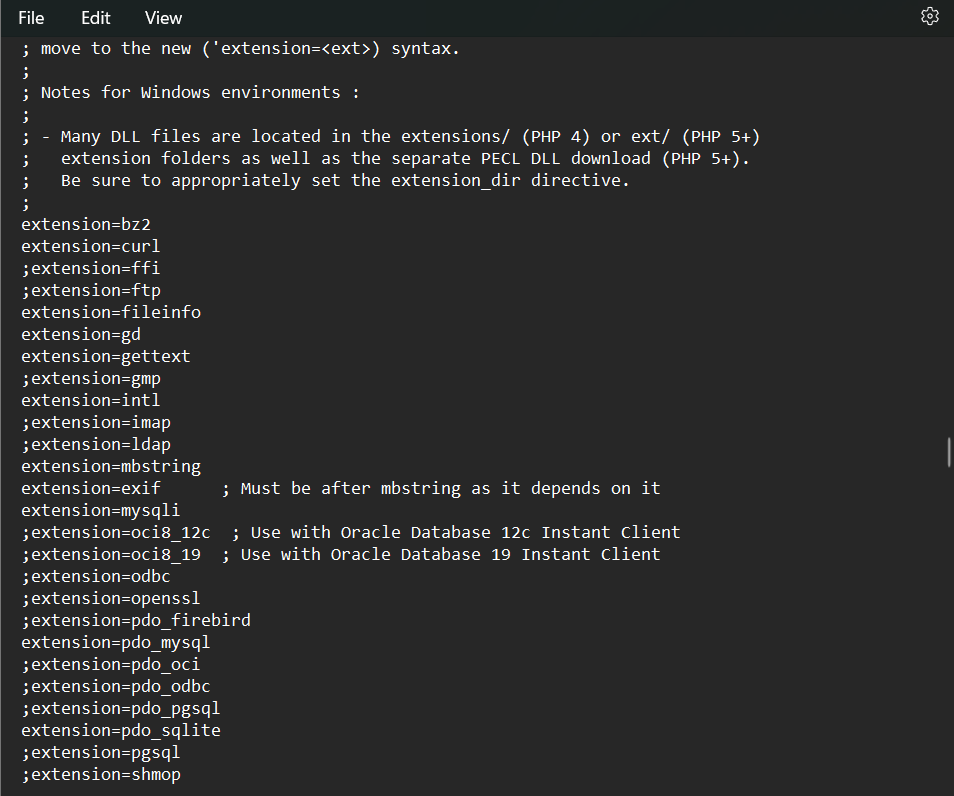
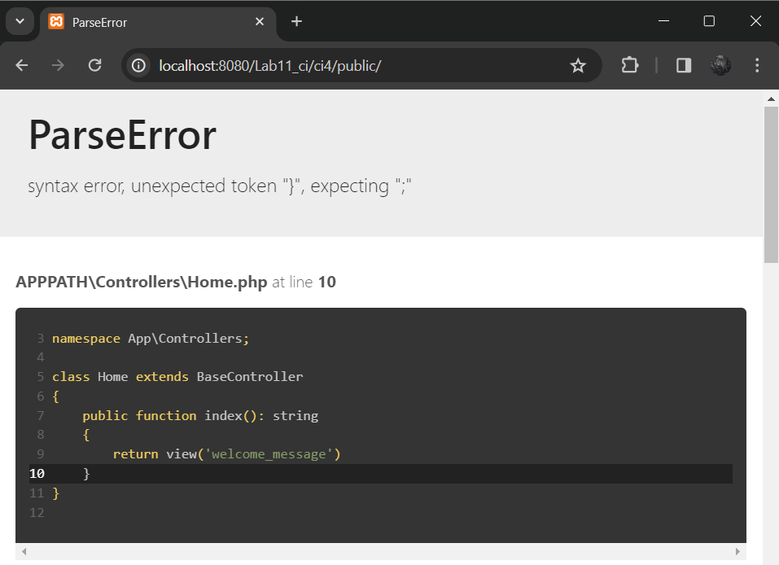
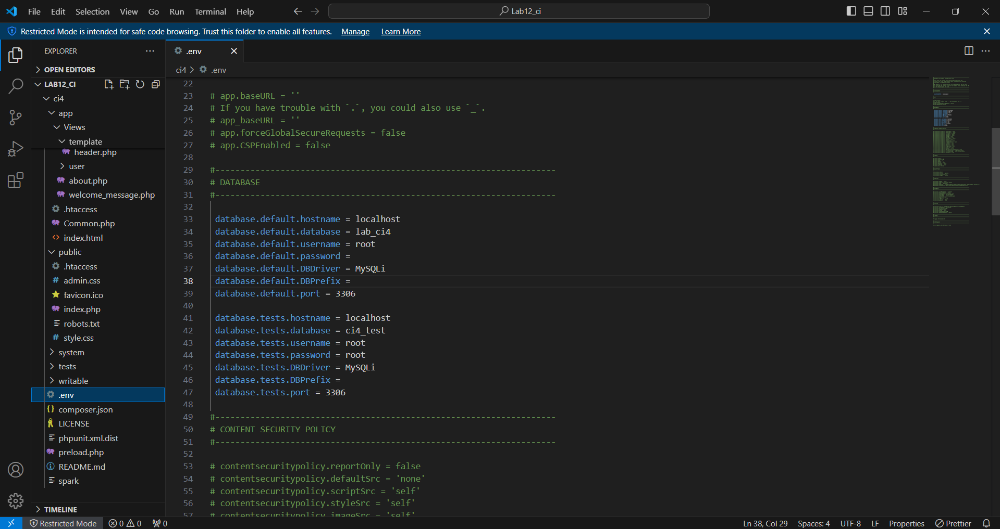
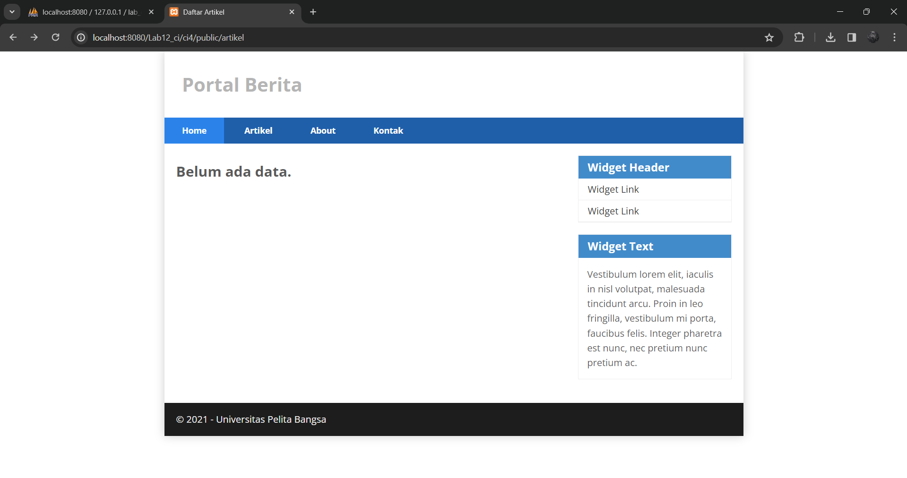
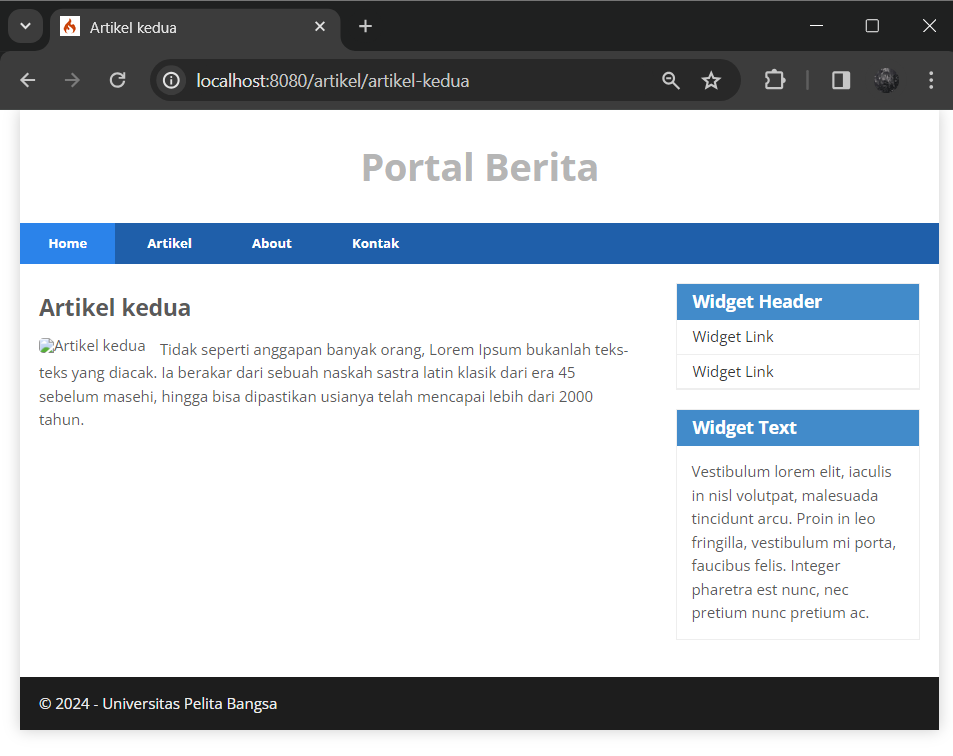
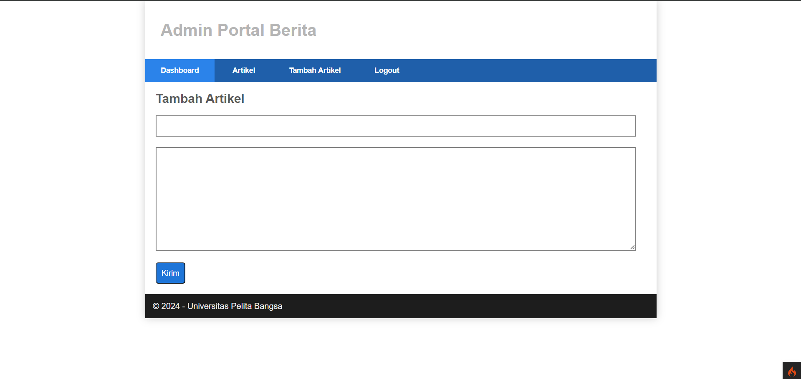
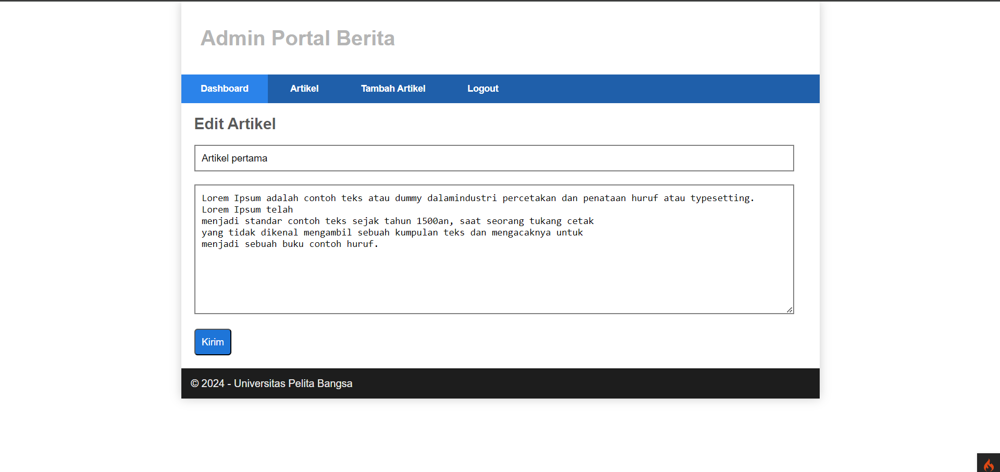
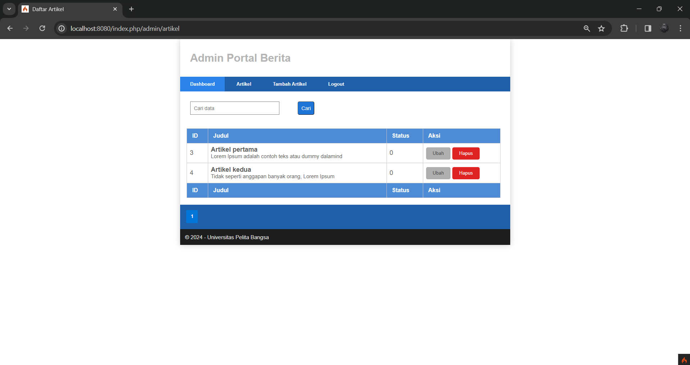

# Praktikum_Ci4

`Nama  : Sandy Ramadhan`

`Nim   : 312210633`

`Kelas : TI22.A4`

# Praktikum 1: PHP Framework (Codeigniter)

## Langkah-langkah Praktikum

1. Persiapan
   Sebelum memulai menggunakan Framework Codeigniter, perlu dilakukan konfigurasi pada webserver. Beberapa ekstensi PHP perlu diaktifkan untuk kebutuhan pengembangan Codeigniter 4
   Berikut beberapa ekstensi yang perlu diaktifkan:

   - php-json ekstension untuk bekerja dengan JSON;
   - php-mysqlnd native driver untuk MySQL;
   - php-xml ekstension untuk bekerja dengan XML;
   - php-intl ekstensi untuk membuat aplikasi multibahasa;
   - libcurl (opsional), jika ingin pakai Curl.

Untuk mengaktifkan ekstentsi tersebut, melalu XAMPP Control Panel, pada bagian Apache klik Config -> PHP.in


2. Pada bagian extention, hilangkan tanda ; (titik koma) pada ekstensi yang akan diaktifkan. Kemudian simpan kembali filenya dan restart Apache web server



## Instalasi Codeigniter 4

Untuk melakukan instalasi Codeigniter 4 dapat dilakukan dengan dua cara, yaitu cara manual dan menggunakan composer. Pada praktikum ini kita menggunakan cara manual.

- Unduh Codeigniter dari website https://codeigniter.com/download
- Extrak file zip Codeigniter ke direktori htdocs/lab11_ci.
- Ubah nama direktory framework-4.x.xx menjadi ci4.
- Buka browser dengan alamat http://localhost/lab11_ci/ci4/public/


## Menjalankan CLI (Command Line Interface)

1. Codeigniter 4 menyediakan CLI untuk mempermudah proses development. Untuk mengakses CLI buka terminal/command prompt.


2. Arahkan lokasi direktori sesuai dengan direktori kerja project dibuat (xampp/htdocs/lab11_ci/ci4/) Perintah yang dapat dijalankan untuk memanggil CLI Codeigniter adalah:


## Mengaktifkan Mode Debugging

1. Codeigniter 4 menyediakan fitur debugging untuk memudahkan developer untuk mengetahui pesan error apabila terjadi kesalahan dalam membuat kode program. Secara default fitur ini belum aktif. Ketika terjadi error pada aplikasi akan ditampilkan pesan kesalahan seperti berikut:


2. Semua jenis error akan ditampilkan sama. Untuk memudahkan mengetahui jenis errornya, maka perlu diaktifkan mode debugging dengan mengubah nilai konfigurasi pada environment variable `CI_ENVIRINMENT` menjadi `development`.


Ubah nama file `env` menjadi `.env` kemudian buka file tersebut dan ubah nilai variable
CI_ENVIRINMENT menjadi development.



Contoh error yang terjadi. Untuk mencoba error tersebut, ubah kode pada file
app/Controller/Home.php hilangkan titik koma pada akhir kode

## Routing dan Controller

Routing merupakan proses yang mengatur arah atau rute dari request untuk menentukan fungsi/bagian mana yang akan memproses request tersebut. Pada framework CI4, routing bertujuan untuk menentukan Controller mana yang harus merespon sebuah request. Controller adalah class atau script yang bertanggung jawab merespon sebuah request. Pada Codeigniter, request yang diterima oleh file index.php akan diarahkan ke Router untuk meudian oleh router tesebut diarahkan ke Controller.

Router terletak pada file app/config/Routes.php

1. Pada file tersebut kita dapat mendefinisikan route untuk aplikasi yang kita buat.

```php
$routes->get('/', 'Home::index');
```

Kode tersebut akan mengarahkan rute untuk halaman home.

2. Tambahkan kode berikut di dalam Routes.php

```php
$routes->get('/about', 'Page::about');
$routes->get('/contact', 'Page::contact');
$routes->get('/faqs', 'Page::faqs');
```


3. Untuk mengetahui route yang ditambahkan sudah benar, buka CLI dan jalankan perintah
   berikut
   `php spark routes`


4. Selanjutnya coba akses route yang telah dibuat dengan mengakses alamat url


Ketika diakses akan mucul tampilan error 404 file not found, itu artinya file/page tersebut tida ada. Untuk dapat mengakses halaman tersebut, harus dibuat terlebih dahulu Contoller yang sesuai dengan routing yang dibuat yaitu Contoller Page

## Membuat Controller

1. Selanjutnya adalah membuat Controller Page. Buat file baru dengan nama page.php pada direktori Controller kemudian isi kodenya seperti berikut.

```php
<?php
namespace App\Controllers;
class Page extends BaseController
{
    public function about()
    {
        echo "Ini halaman About";
    }
    public function contact()
    {
        echo "Ini halaman Contact";
    }
    public function faqs()
    {
        echo "Ini halaman FAQ";
    }
}
```

2. Selanjutnya refresh Kembali browser, maka akan ditampilkan hasilnya yaitu halaman sudah dapat diakses.


## Auto Routing

1. Secara default fitur autoroute pada Codeiginiter sudah aktif. Untuk mengubah status autoroute dapat mengubah nilai variabelnya. Untuk menonaktifkan ubah nilai true menjadi false.

`$routes->setAutoRoute(true);`

2. Tambahkan method baru pada Controller Page seperti berikut.

```php
public function tos()
{
echo "ini halaman Term of Services";
}
```

Method ini belum ada pada routing, sehingga cara mengaksesnya dengan menggunakan
alamat: http://localhost:8080/page/tos


## Membuat View

1. Selanjutnya adalam membuat view untuk tampilan web agar lebih menarik. Buat file baru dengan nama about.php pada direktori view (app/view/about.php) kemudian isi kodenya seperti berikut:

```html
<!DOCTYPE html>
<html lang="en">
  <head>
    <meta charset="UTF-8" />
    <meta http-equiv="X-UA-Compatible" content="IE=edge" />
    <meta name="viewport" content="width=device-width, initial-scale=1.0" />
    <title><?= $title; ?></title>
  </head>
  <body>
    <h1><?= $title; ?></h1>
    <hr />
    <p><?= $content; ?></p>
  </body>
</html>
```

2. Ubah method about pada class Controller Page menjadi seperti berikut:

```php
public function about(){
    return view('about', [
        'title' => 'Halaman About',
        'content' => 'Ini adalah Halaman About yang menjelaskan tentang isi halaman, dibuat melalui Views'
    ]);
}
```

3. Kemudian lakukan refresh pada halaman tersebut.


## Membuat Layout Web dengan CSS

Pada dasarnya layout web dengan css dapat diimplamentasikan dengan mudah pada codeigniter. Yang perlu diketahui adalah, pada Codeigniter 4 file yang menyimpan asset css dan javascript terletak pada direktori public.

1.  Buat file css pada direktori public dengan nama style.css copy file dari praktikum lab4_layout. Kita akan gunakan layout yang pernah dibuat pada praktikum 4.

2.  Kemudian buat folder template pada direktori view kemudian buat file `header.php` dan `footer.php`


3. Kemudian ubah file app/view/about.php seperti berikut


### Output Final Tampilan Website Praktikum 1


# Praktikum 2: Framework Lanjutan (CRUD)

## Langkah-Langkah Praktikum

1. Persiapan
   Untuk memulai membuat aplikasi CRUD sederhana,
   yang perlu disiapkan adalah database server menggunakan MySQL.
   Pastikan MySQL Server sudah dapat dijalankan melalui
   XAMPP

2. Membuat Database: Studi Kasus Data Artikel

```sql
CREATE DATABASE lab_ci4;
```

```sql
CREATE TABLE artikel (
id INT(11) auto_increment,
judul VARCHAR(200) NOT NULL,
isi TEXT,
gambar VARCHAR(200),
status TINYINT(1) DEFAULT 0,
slug VARCHAR(200),
PRIMARY KEY(id)
);
```


3. Konfigurasi koneksi database

Selanjutnya membuat konfigurasi untuk menghubungkan dengan database server.
Konfigurasi dapat dilakukan dengan du acara, yaitu pada file `app/config/database.php` atau menggunakan file `.env`.
Pada praktikum ini kita gunakan konfigurasi pada file `.env`.



3. Membuat Model dan Controllers

Selanjutnya adalah membuat Model untuk memproses data Artikel. Buat file baru pada direktori `app/Models` dengan nama `ArtikelModel.php` dan membuat Controller baru dengan nama `Artikel.php` pada direktori `app/Controllers`.

```php
<?php
namespace App\Models;
use CodeIgniter\Model;
class ArtikelModel extends Model
{
 protected $table = 'artikel';
 protected $primaryKey = 'id';
 protected $useAutoIncrement = true;
 protected $allowedFields = ['judul', 'isi', 'status', 'slug',
'gambar'];
}

```

```php
<?php
namespace App\Controllers;
use App\Models\ArtikelModel;
class Artikel extends BaseController
{
 public function index()
 {
 $title = 'Daftar Artikel';
 $model = new ArtikelModel();
 $artikel = $model->findAll();
 return view('artikel/index', compact('artikel', 'title'));
 }
}
```

4. Membuat View

Buat direktori baru dengan nama artikel pada direktori `app/views`, kemudian buat file baru
dengan nama `index.php`.

```php
<?= $this->include('template/header'); ?>
<?php if($artikel): foreach($artikel as $row): ?>
<article class="entry">
 <h2<a href="<?= base_url('/artikel/' . $row['slug']);?>"><?=
$row['judul']; ?></a>
</h2>
 " alt="<?=
$row['judul']; ?>">
 <p><?= substr($row['isi'], 0, 200); ?></p>
</article>
<hr class="divider" />
<?php endforeach; else: ?>
<article class="entry">
 <h2>Belum ada data.</h2>
</article>
<?php endif; ?>
<?= $this->include('template/footer'); ?>
```



Belum ada data yang diampilkan. Kemudian coba tambahkan beberapa data pada database agar
dapat ditampilkan datanya.


5. Membuat Tampilan Detail Artikel

Tampilan pada saat judul berita di klik maka akan diarahkan ke halaman yang berbeda.
Tambahkan fungsi baru pada Controller Artikel dengan nama view().

```php
public function view($slug)
{
$model = new ArtikelModel();
$artikel = $model->where(['slug' => $slug])->first();

// Menampilkan error apabila data tidak ada.
if (!$artikel) {
throw PageNotFoundException::forPageNotFound();
}
$title = $artikel['judul'];
return view('artikel/detail', compact('artikel', 'title'));
}
```

Buat view baru untuk halaman detail dengan nama app/views/artikel/detail.php.

```php
   <?= $this->include('template/header'); ?>

    <article class="entry">
        <h2><?= $artikel['judul']; ?></h2>
        " alt="<?= $artikel['judul']; ?>">
        <p><?= $artikel['isi']; ?></p>
    </article>

    <?= $this->include('template/footer'); ?>
```


Selanjutnya, buka kembali file app/config/Routes.php, kemudian tambahkan routing untuk artikel detail.

```php
$routes->get('/artikel/(:any)', 'Artikel::view/$1');
```



6. Membuat Menu Admin

Menu admin adalah untuk proses CRUD data artikel.
Buat method baru pada Controller Artikel dengan nama admin_index().

```php
public function admin_index()
 {
 $title = 'Daftar Artikel';
 $model = new ArtikelModel();
 $artikel = $model->findAll();
 return view('artikel/admin_index', compact('artikel', 'title'));
 }
```

Selanjutnya buat view untuk tampilan admin dengan nama admin_index.php

```php
<?= $this->include('template/admin_header'); ?>
<table class="table">
 <thead>
 <tr>
 <th>ID</th>
 <th>Judul</th>
 <th>Status</th>
 <th>AKsi</th>
 </tr>
 </thead>
 <tbody>
 <?php if($artikel): foreach($artikel as $row): ?>
 <tr>
 <td><?= $row['id']; ?></td>
 <td>
 <b><?= $row['judul']; ?></b>
 <p><small><?= substr($row['isi'], 0, 50); ?></small></p>
 </td>
 <td><?= $row['status']; ?></td>
 <td>
 <a class="btn" href="<?= base_url('/admin/artikel/edit/' .
$row['id']);?>">Ubah</a>
 <a class="btn btn-danger" onclick="return confirm('Yakin
menghapus data?');" href="<?= base_url('/admin/artikel/delete/' .
$row['id']);?>">Hapus</a>
 </td>
 </tr>
 <?php endforeach; else: ?>
 <tr>
 <td colspan="4">Belum ada data.</td>
 </tr>
 <?php endif; ?>
 </tbody>
 <tfoot>
 <tr>
 <th>ID</th>
 <th>Judul</th>
 <th>Status</th>
 <th>AKsi</th>
 </tr>
 </tfoot>
</table>
<?= $this->include('template/admin_footer'); ?>
```

Tambahkan routing untuk menu admin seperti berikut:

```php
$routes->group('admin', function($routes) {
$routes->get('artikel', 'Artikel::admin_index');
$routes->add('artikel/add', 'Artikel::add');
$routes->add('artikel/edit/(:any)', 'Artikel::edit/$1');
$routes->get('artikel/delete/(:any)', 'Artikel::delete/$1');
});
```


7. Menambah Data Artikel

Tambahkan fungsi/method baru pada Controller Artikel dengan nama add().

```php
public function add()
 {
 // validasi data.
 $validation = \Config\Services::validation();
 $validation->setRules(['judul' => 'required']);
 $isDataValid = $validation->withRequest($this->request)->run();
 if ($isDataValid)
 {
 $artikel = new ArtikelModel();
 $artikel->insert([
 'judul' => $this->request->getPost('judul'),
'isi' => $this->request->getPost('isi'),
 'slug' => url_title($this->request->getPost('judul')),
 ]);
 return redirect('admin/artikel');
 }
 $title = "Tambah Artikel";
 return view('artikel/form_add', compact('title'));
 }
```

Kemudian buat view untuk form tambah dengan nama form_add.php

```php
<?= $this->include('template/admin_header'); ?>
<h2><?= $title; ?></h2>
<form action="" method="post">
 <p>
 <input type="text" name="judul">
 </p>
 <p>
 <textarea name="isi" cols="50" rows="10"></textarea>
 </p>
 <p><input type="submit" value="Kirim" class="btn btn-large"></p>
</form>
<?= $this->include('template/admin_footer'); ?>
```



8. Mengubah Data

Tambahkan fungsi/method baru pada Controller Artikel dengan nama edit().

```php
public function edit($id)
 {
 $artikel = new ArtikelModel();
 // validasi data.
 $validation = \Config\Services::validation();
 $validation->setRules(['judul' => 'required']);
 $isDataValid = $validation->withRequest($this->request)->run();
 if ($isDataValid)
 {
 $artikel->update($id, [
 'judul' => $this->request->getPost('judul'),
 'isi' => $this->request->getPost('isi'),
 ]);
 return redirect('admin/artikel');
 }
 // ambil data lama
 $data = $artikel->where('id', $id)->first();
 $title = "Edit Artikel";
 return view('artikel/form_edit', compact('title', 'data'));
 }
```

```php
Kemudian buat view untuk form tambah dengan nama form_edit.php

<?= $this->include('template/admin_header'); ?>
<h2><?= $title; ?></h2>
<form action="" method="post">
 <p>
 <input type="text" name="judul" value="<?= $data['judul'];?>" >
 </p>
 <p>
 <textarea name="isi" cols="50" rows="10"><?=
$data['isi'];?></textarea>
 </p>
 <p><input type="submit" value="Kirim" class="btn btn-large"></p>
</form>
<?= $this->include('template/admin_footer'); ?>
```



9. Menghapus Data

Tambahkan fungsi/method baru pada Controller Artikel dengan nama delete().

```php
public function delete($id)
 {
 $artikel = new ArtikelModel();
 $artikel->delete($id);
 return redirect('admin/artikel');
 }
```

# Praktikum 3: Framework Lanjutan (Modul Login)

## Langkah-Langkah Praktikum

1. Persiapan
   Untuk memulai membuat aplikasi CRUD sederhana,
   yang perlu disiapkan adalah database server menggunakan MySQL.
   Pastikan MySQL Server sudah dapat dijalankan melalui
   XAMPP

2. Membuat Tabel: User Login

```sql
CREATE TABLE user (
 id INT(11) auto_increment,
 username VARCHAR(200) NOT NULL,
 useremail VARCHAR(200),
 userpassword VARCHAR(200),
 PRIMARY KEY(id)
);
```


3. Membuat Model User

Selanjutnya adalah membuat Model untuk memproses data Login.
Buat file baru pada direktori app/Models dengan nama UserModel.php

```php
<?php
namespace App\Models;
use CodeIgniter\Model;
class UserModel extends Model
{
 protected $table = 'user';
 protected $primaryKey = 'id';
protected $useAutoIncrement = true;
 protected $allowedFields = ['username', 'useremail', 'userpassword'];
}
```

4. Membuat Controller User

Buat Controller baru dengan nama User.php pada direktori app/Controllers.
Kemudian tambahkan method index() untuk menampilkan daftar user,
dan method login() untuk proses login.

```php
<?php
namespace App\Controllers;
use App\Models\UserModel;
class User extends BaseController
{
 public function index()
 {
 $title = 'Daftar User';
 $model = new UserModel();
 $users = $model->findAll();
 return view('user/index', compact('users', 'title'));
 }
 public function login()
 {
 helper(['form']);
 $email = $this->request->getPost('email');
 $password = $this->request->getPost('password');
 if (!$email)
 {
 return view('user/login');
 }
 $session = session();
 $model = new UserModel();
 $login = $model->where('useremail', $email)->first();
 if ($login)
 {
 $pass = $login['userpassword'];
 if (password_verify($password, $pass))
 {
 $login_data = [
 'user_id' => $login['id'],
 'user_name' => $login['username'],
 'user_email' => $login['useremail'],
 'logged_in' => TRUE,
 ];
$session->set($login_data);
 return redirect('admin/artikel');
 }
 else
 {
 $session->setFlashdata("flash_msg", "Password salah.");
 return redirect()->to('/user/login');
 }
 }
 else
 {
 $session->setFlashdata("flash_msg", "email tidak terdaftar.");
 return redirect()->to('/user/login');
 }
 }
}
```

5. Membuat View Login

Buat direktori baru dengan nama user pada direktori app/views,
kemudian buat file baru dengan nama login.php.

```php
<!DOCTYPE html>
<html lang="en">
<head>
 <meta charset="UTF-8">
 <title>Login</title>
 <link rel="stylesheet" href="<?= base_url('/style.css');?>">
</head>
<body>
 <div id="login-wrapper">
 <h1>Sign In</h1>
 <?php if(session()->getFlashdata('flash_msg')):?>
 <div class="alert alert-danger"><?= session()-
>getFlashdata('flash_msg') ?></div>
 <?php endif;?>
 <form action="" method="post">
 <div class="mb-3">
 <label for="InputForEmail" class="form-label">Email
address</label>
 <input type="email" name="email" class="form-control"
id="InputForEmail" value="<?= set_value('email') ?>">
 </div>
 <div class="mb-3">
 <label for="InputForPassword" class="form-label">Password</label>
 <input type="password" name="password" class="form-control" id="InputForPassword">
 </div>
 <button type="submit" class="btn btn-primary">Login</button>
 </form>
 </div>
</body>
</html>
```

6. Membuat Database Seeder

Database seeder digunakan untuk membuat data dummy.
Untuk keperluan ujicoba modul login, kita perlu memasukkan data user dan password kedaalam database.
Untuk itu buat database seeder untuk tabel user.
Buka CLI, kemudian tulis perintah berikut:


Selanjutnya, buka file UserSeeder.php yang berada di lokasi direktori
/app/Database/Seeds/UserSeeder.php kemudian isi dengan kode berikut:

```php
<?php
namespace App\Database\Seeds;
use CodeIgniter\Database\Seeder;
class UserSeeder extends Seeder
{
public function run()
{
$model = model('UserModel');
$model->insert([
'username' => 'admin',
'useremail' => 'admin@email.com',
'userpassword' => password_hash('admin123', PASSWORD_DEFAULT),
]);
}
}
```

Selanjutnya buka kembali CLI dan ketik perintah berikut:


7. Menambahkan Auth Filter

Selanjutnya membuat filer untuk halaman admin. Buat file baru dengan nama Auth.php pada
direktori app/Filters.

```php
<?php namespace App\Filters;
use CodeIgniter\HTTP\RequestInterface;
use CodeIgniter\HTTP\ResponseInterface;
use CodeIgniter\Filters\FilterInterface;
class Auth implements FilterInterface
{
public function before(RequestInterface $request, $arguments = null)
{
// jika user belum login
if(! session()->get('logged_in')){
// maka redirct ke halaman login
return redirect()->to('/user/login');
}
}
public function after(RequestInterface $request, ResponseInterface
$response, $arguments = null)
{
// Do something here
}
}
```

Selanjutnya buka file app/Config/Filters.php tambahkan kode berikut:

`'auth' => App\Filters\Auth::class`

Selanjutnya buka file app/Config/Routes.php dan sesuaikan kodenya.

```php
$routes->group('admin', ['filter' => 'auth'], function ($routes) {
    $routes->get('artikel', 'Artikel::admin_index');
    $routes->add('artikel/add', 'Artikel::add');
    $routes->add('artikel/edit/(:any)', 'Artikel::edit/$1');
    $routes->get('artikel/delete/(:any)', 'Artikel::delete/$1');
    $routes->add('logout', 'User::logout');
});
```


8. Fungsi Logout

Tambahkan method logout pada Controller User seperti berikut:

```php
public function logout()
 {
session()->destroy();
 return redirect()->to('/user/login');
 }
```

# Praktikum 4: Pagination dan Pencarian

## Langkah-Langkah Praktikum

1. Membuat Pagination

Pagination merupakan proses yang digunakan untuk membatasi tampilan yang panjang dari data yang banyak pada sebuah website.
Fungsi pagination adalah memecah tampilan menjadi beberapa halaman tergantung banyaknya data yang akan ditampilkan pada setiap halaman.

Pada Codeigniter 4, fungsi pagination sudah tersedia pada Library sehingga cukup mudah menggunakannya.

Untuk membuat pagination, buka Kembali Controller Artikel, kemudian modifikasi kode pada method admin_index seperti berikut.

```php
public function admin_index()
 {
 $title = 'Daftar Artikel';
 $model = new ArtikelModel();
 $data = [
 'title' => $title,
 'artikel' => $model->paginate(10), #data dibatasi 10 record
per halaman
 'pager' => $model->pager,
 ];
 return view('artikel/admin_index', $data);
 }
```

Kemudian buka file views/artikel/admin_index.php dan tambahkan kode berikut
dibawah deklarasi tabel data

```php
<?= $pager->links(); ?>
```

2. Membuat Pencarian

Pencarian data digunakan untuk memfilter data.
Untuk membuat pencarian data, buka kembali Controller Artikel,
pada method admin_index ubah kodenya seperti berikut.

```php
public function admin_index()
 {
 $title = 'Daftar Artikel';
 $q = $this->request->getVar('q') ?? '';
 $model = new ArtikelModel();
 $data = [
 'title' => $title,
 'q' => $q,
 'artikel' => $model->like('judul', $q)->paginate(10), # data
dibatasi 10 record per halaman
 'pager' => $model->pager,
 ];
 return view('artikel/admin_index', $data);
 }
```

Kemudian buka kembali file views/artikel/admin_index.php dan tambahkan form
pencarian sebelum deklarasi tabel seperti berikut:

```php
<form method="get" class="form-search">
 <input type="text" name="q" value="<?= $q; ?>" placeholder="Cari data">
 <input type="submit" value="Cari" class="btn btn-primary">
</form>
```

Dan pada link pager ubah seperti berikut.

```php
<?= $pager->only(['q'])->links(); ?>
```

### Output Final Tampilan Website Praktikum 4



```

 TERIMAKASIH :)

```
